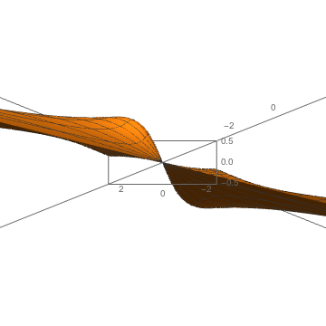
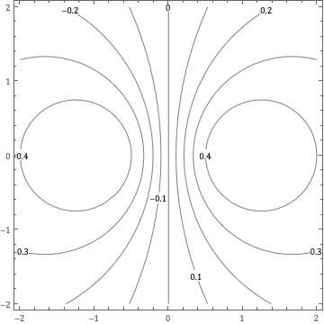
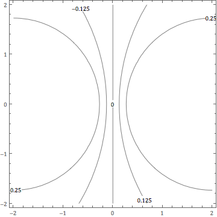
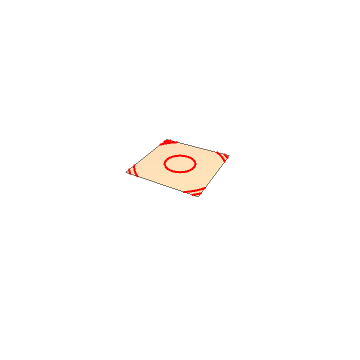
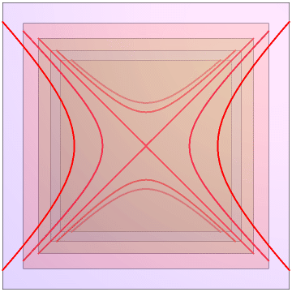

A photo gallery for MATH 2310. Enjoy.

The first example is

$$f(x) = x / (1 + x^{2} + y^{2}) $$

which looks like

 | 

We also have some of the surface contours

 | 

Next, is a big octupus:

$$f(x,y) = \cos(x^{2} + y^{2}) $$

 | 

Here's the saddle contours:

$$f(x,y) = y^{2} - x^{2} $$

