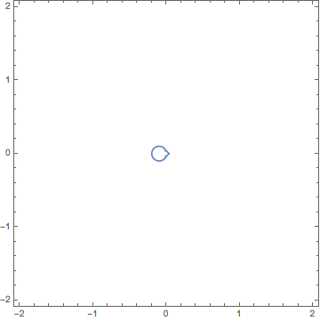

My previous work has focused on the interactions between trisections of four-manifolds and Heegaard Floer homology. I have a few new project ideas which, if I'm lucky, will broaden the scope of the trisection theory. Briefly, these projects look like:

- Engel trisections. Does every Engel four-manifold admit a trisection which is compatible with its Engel structure?
- Equivariant trisections. Can one lift the analogy with equivariant Heegaard splittings to trisections of four-manifolds?
- Cyclic (co)homology of trisections. Do characteristic classes on the underlying four-manifold reduce to cyclic cohomology classes on a central surface?
 

This is my blog. I like to write about the math ideas I have which, so far, have revolved around developing the theory of trisections in some shape or form. Sharing these ideas is meant to encourage discussions and collaborations with other people, so if any of these ideas catch your eye, feel free to send me an email.

Here's a gif I made


    
  
    
  

  
    
      <h2 class="post-list-heading">{{ page.list_title }}</h2>
    
    <ul class="post-list">
      {%- assign date_format = site.minima.date_format | default: "%b %-d, %Y" -%}
      
      <li>
        {{ post.date | date: date_format }}
        <h3>
          <a class="post-link" href="{{ post.url | relative_url }}">
            {{ post.title | escape }}
          </a>
        </h3>
        
          {{ post.excerpt }}
        
      </li>
      
    </ul>

    
      

        <ul class="pagination">
        
          <li><a href="{{ paginator.previous_page_path | relative_url }}" class="previous-page">{{ paginator.previous_page }}</a></li>
        
          <li>
•
</li>
        
          <li>
{{ paginator.page }}
</li>
        
          <li><a href="{{ paginator.next_page_path | relative_url }}" class="next-page">{{ paginator.next_page }}</a></li>
        
          <li>
•
</li>
        
        </ul>
      

    


