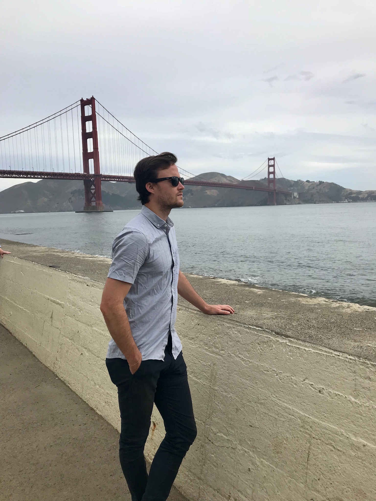

---
# Feel free to add content and custom Front Matter to this file.
# To modify the layout, see https://jekyllrb.com/docs/themes/#overriding-theme-defaults

layout: home
title: About
---

I currently hold an RTG postdoctoral position at the University of Virginia. Last year (Fall 2019 -- Spring 2020), I was a visitor at the Max Planck Institute for Mathethematics, in Bonn, Germany. I'm interested in smooth four-dimensional topology with specific interest in topics related to trisections of four-manifolds and Heegaard Floer homology. I recently finished my Ph.D. at the University of Georgia under the direction of David Gay.

